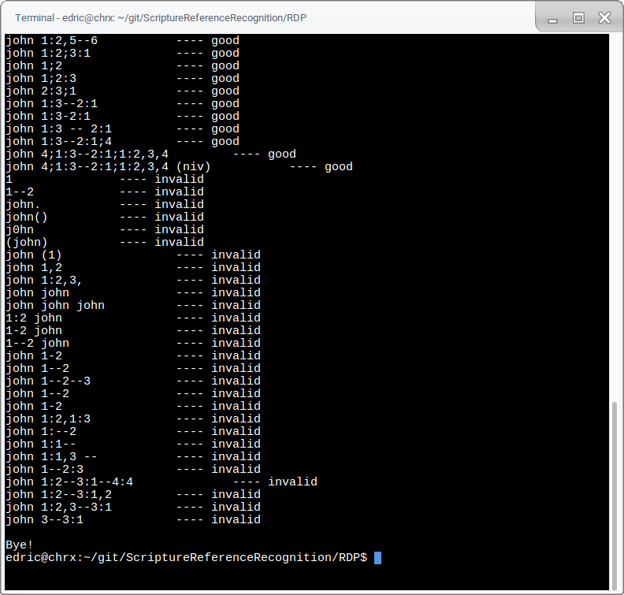

# A01 - Language Recognition

Submission Tree
-----------

~~~~
submission
│   readme.html
│
├───ANTLR
│   │   screenshot.png
│   │   Scripture.g4
│   │
│   ├───gen
│   │       Scripture.interp
│   │       Scripture.tokens
│   │       ScriptureBaseListener.java
│   │       ScriptureBaseVisitor.java
│   │       ScriptureLexer.interp
│   │       ScriptureLexer.java
│   │       ScriptureLexer.tokens
│   │       ScriptureListener.java
│   │       ScriptureParser.java
│   │       ScriptureVisitor.java
│   │
│   ├───inputs
│   │       test.txt
│   │
│   └───src
│           Test.java
│
├───RDP
│       Makefile
│       screenshot1.png
│       screenshot2.png
│       scripture
│       scripture.c
│       smalltest.txt
│       test.txt
│       tokens.h
│
└───RegEx
        screenshot1.png
        screenshot2.png
        scripture.pl
        smalltest.txt
        test.txt
~~~~

Student Info
=============

Your name: Edric Yu

Operating system: Windows 10, GalliumOS (sorry if line endings are inconsistent!)

Lab computer or your own computer: my own

Did you receive help from your instructor? A little bit

Implementations
================

ANTLR
--------------------------------

<!-- Details and screenshots here -->
It's pretty much just a transcribed version of the grammar rules.

I added a rule to for the extra credit cases. It was the first
thing I thought of, and it worked. I am uncertain of its
elegance as a solution.

The test file has 61 lines. Lines 34 and below should all have errors.

Tested on Windows.

RDP
--------------------------------

<!-- Details and screenshots here -->
I copied the provided lexer `next()`, but modified it to not use `stdin`.
Grammar rules were used as a guide. Originally, the functions reflected the
rules very directly. However, the inclusion of extra credit made one of the 
functions a lot messier.

Finding which lines have errors is a lot harder than showing all errors.
The test file is set up that every line below a certain point
should have at least one error.

Tested on Linux and Windows.

Perl RegEx
--------------------------------
<!-- Details and screenshots here -->
For whatever reason, my Windows computer runs into weird errors with Perl strings,
so I did this mostly on my Linux laptop. I stored regex patterns in variables
to avoid giant lines of RegEx.

This also allows for the program have an idea of what went wrong.
If the line doesn't match, it can report if the book is missing.
Otherwise the leftover non-matching characters will be displayed.

Grammar rules were used as a guide -- many parallels can be
drawn between the grammar rules and the regex patterns.

Tested on Linux.

Full Test File
---------------------------------
Each of the implementations were validated with this test set.
The tests I ran were not fully exhaustive, but I think this is enough to prove they work.
~~~ plaintext linenumbers
//valid
john
John
JOHN
1 john
john (esv)
1 john (niv)
1john
john 1
john1
john 1:2
john1:2
john 1 : 2
john 1:2-3
john 1:2--3
1 john 1:2
1john 1:2
1 john1:2
john 1:2,4
john 1:2,4,6
john 1:2--3,5--6
john 1:2--3,5--6 (esv)
john 1:2--3,5
john 1:2,5--6
john 1:2;3:1
john 1;2
john 1;2:3
john 2:3;1

//extra credit
john 1:3--2:1
john 1:3-2:1
john 1:3 -- 2:1
john 1:3--2:1;4
john 4;1:3--2:1;1:2,3,4
john 4;1:3--2:1;1:2,3,4 (niv)

//invalid
1
1--2
john.
john()
j0hn
(john)
john (1)
john 1,2
john 1:2,3,
john john
john john john
1:2 john
1-2 john
1--2 john
john 1-2
john 1--2
john 1--2--3
john 1--2
john 1-2
john 1:2,1:3
john 1:--2
john 1:1--
john 1:1,3 --
john 1--2:3
john 1:2--3:1--4:4
john 1:2--3:1,2
john 1:2,3--3:1
john 3--3:1
~~~

Assignment Reflection
======================

Hours to complete assignment: ~5

List any other comments below.
Feel free to provide any feedback on how much you learned from doing the assignment, and whether you enjoyed doing it.

This was fun! It would've been nice to have a set of tests to know exactly what the program should do
(If you want to start compiling one, I have no problems with you using mine).
